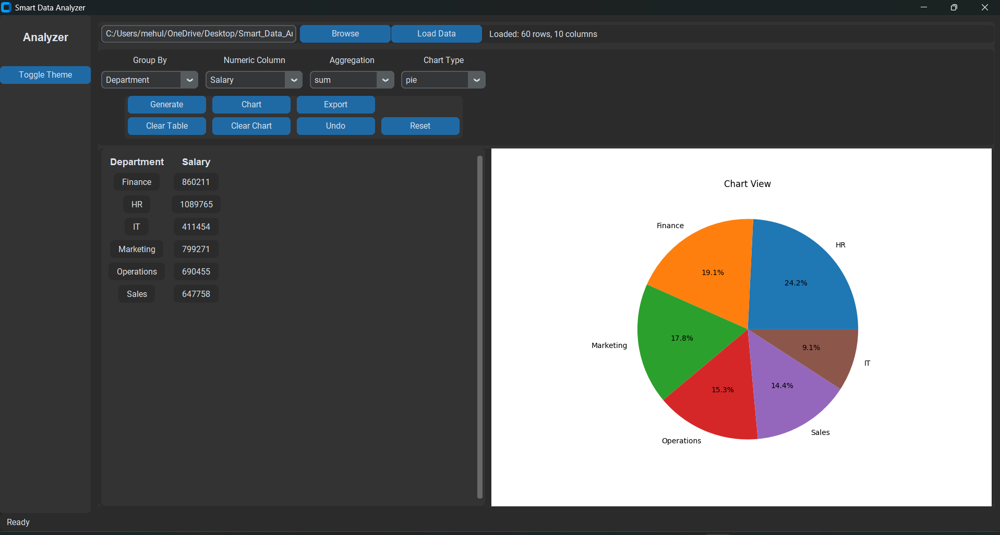
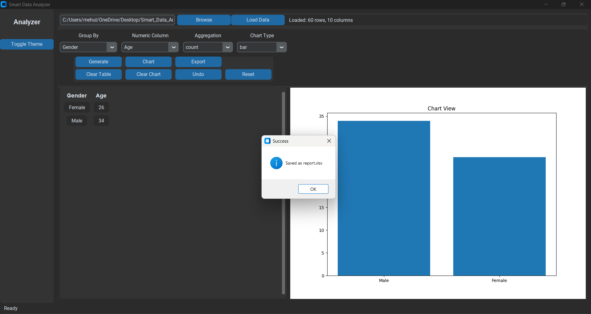

# 📊 Smart Data Analyzer

A modern desktop-based **Data Analysis Dashboard** built using **Python, Pandas, Matplotlib, OpenPyXL, and CustomTkinter**. This application allows users to analyze CSV and Excel datasets, generate summarized reports, visualize insights with charts, and export results to Excel through an intuitive graphical interface.

---

## ✨ Features

- 📂 Import CSV and Excel datasets
- 📊 Generate dynamic reports using Group By operations
- ➕ Perform Sum, Mean, Count, Maximum, and Minimum aggregations
- 📈 Visualize data using Bar, Line, and Pie charts
- 💾 Export generated reports to Excel
- ↩️ Undo previous action
- 🌙 Dark/Light Theme support
- 🖥️ Modern and user-friendly desktop interface
- 📁 Sample datasets included for testing

---

## 🛠️ Tech Stack

- Python
- Pandas
- Matplotlib
- CustomTkinter
- OpenPyXL

---

## 📸 Screenshots

### Home Screen



---

### Report & Chart



---

## 📂 Project Structure

```text
Smart-Data-Analyzer/
│
├── assets/
│   └── app.ico
│
├── data/
│   ├── sample_employee_data.csv
│   └── sample_employee_data.xlsx
│
├── modules/
│   ├── chart_handler.py
│   ├── data_processor.py
│   └── file_handler.py
│
├── screenshots/
│   ├── 1.png
│   └── 2.png
│
├── main.py
├── requirements.txt
└── README.md
```

---

## ⚙️ Installation

1. Clone the repository

```bash
git clone https://github.com/mehulchavan11/Smart-Data-Analyzer.git
```

2. Navigate to the project directory

```bash
cd Smart-Data-Analyzer
```

3. Install the required packages

```bash
pip install -r requirements.txt
```

4. Run the application

```bash
python main.py
```

---

## 📊 Sample Dataset

The repository includes sample datasets inside the **data/** folder to help users quickly test all application features without creating their own dataset.

Supported formats:
- CSV (.csv)
- Excel (.xlsx)

---

## 🚀 Future Improvements

- Data filtering options
- Dashboard KPI cards
- PDF report export
- SQL database connectivity
- Additional chart types
- Advanced analytics features

---

## 👨‍💻 Author

**Mehul Chavan**

- GitHub: https://github.com/mehulchavan11
- LinkedIn: https://www.linkedin.com/in/mehulchavan11/

---

⭐ If you found this project useful, consider giving it a **Star** on GitHub!
